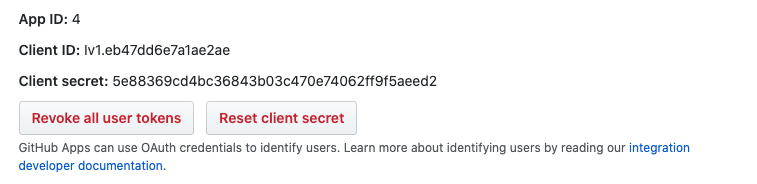

# [BluBracket](https://blubracket.com/) GitHub Checks App tools

## Requirements
- [python >= 3.6](https://www.python.org/downloads/)

## Creating a GitHub Enterprise Server App
1. Run `python3 github-checks-app-on-enterprise-server.py`
2. When prompted, input your enterprise server domain
3. Copy/paste the URL into a browser of your choice
4. Take note of the `webhook_secret=<webhook_secret>` in the URL
    ```
    > python3 creating-github-enterprise-server-app.py
    Enter your GitHub Enterprise Server domain name (i.e. github.companyname.com): github.acme.com
    https://github.acme.com...webhook_secret=Z1KPOYifctpzOjfphKj_hqRlZbrDOBG9AU7hgj7iPrk...
    ```
5. Manually add the `webhook_secret` into the form, since setting webhook secret via query params is no longer supported 
6. Scroll down to click `Create GitHub App`
   
7. Once the app is created, you'll be redirected to the settings page of the app. Send us the `webhook_secret` from the URL above, as well as the `app_name`, `app_ID`, `client_ID`, `client_secret`, `private_key`:
 

